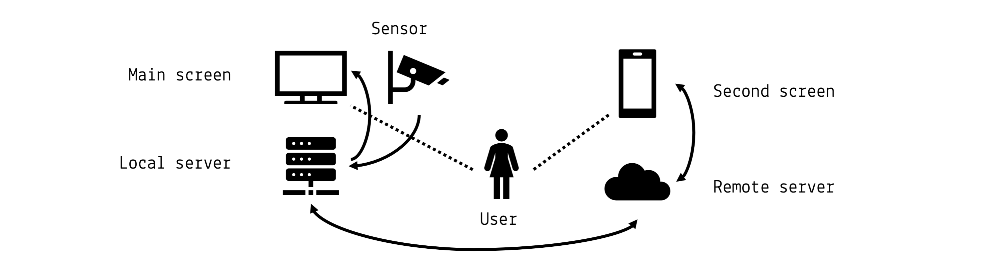
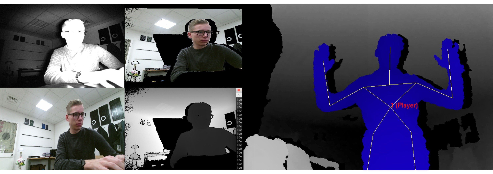
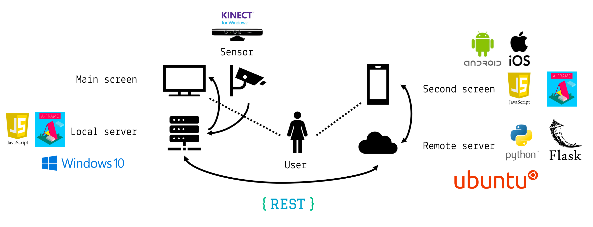
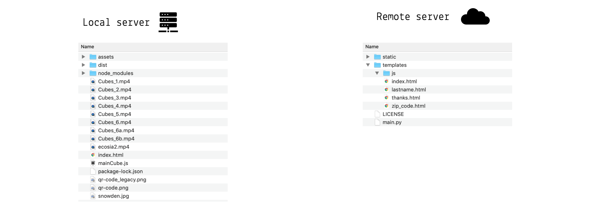

# Technical documentation
`Author: **Elias Grünewald**`

In this chapter, the technical documentation is presented. First, a use case analysis and Requirements Engineering is performed. Later, the prototypical implementation is discussed.

## Requirements Engineering
In order to conceptualize the implementation, a concise Requirements elicitation was carried out. The resulting requirements are listed below in their respective category.

## Functional requirements
**Identify and track body** The concept which was explained above requires exact body tracking. Therefore, the prototype has to be able to identify a human being by its characteristic features (such as arms, legs, head and others). Furthermore, the body parts have to be tracked during natural movements. In addition, the software has to detect the distance of the user to the device and react accordingly to the proximity model which was explained before.

**Display and animate 3D objects in a virtual environment** The concept requires to visually represent the given contents. For that purpose, 3D objects have to be visualized. This visualization includes abstract shapes (such as cubes, spheres, rectangles, planes), texts and hypermedia elements (such as videos and pictures). All of these elements have to be presented in a 3D virtual environment in order to visually mock the human being from the real world in the virtual one including the characteristic movements.

**Parse user input** The system under development has to parse user inputs. These user inputs can be of different types. Not only movements have to be tracked, but also textual content has to be transferred from the user to the system. Different methodologies such as speech recognition, haptic feature extraction or inputs through a (virtual) keyboard have to be considered. However, the first prototype has to include a functionality to parse textual content in form of strings and numbers transmitted without physical interaction but communication technology.

**Provide feedback** Every action that is performed by the user has its respective feedback that has to be provided through the system. These feedbacks are explicitly dedicated to the different stages of interaction. Feedback in this case is provided visually through animations within a given stage or stage transitions.

**Display customer-specific content** Since this solution was conceptualized together with a real-world business partner, namely IGP Decaux, customer-specific content has to be included. For the first prototype this regards to the content of Ecosia, a privacy-friendly search-engine.


## Non-functional requirements

**Attract attention and transport emotions** This project aims to attract public attention and transport human emotions. This fact includes a visually appealing appearance of the overall user interface and interaction (UI, UX). Consequently, the design language has to be clear and easy to understand.

**Performance** The system under development has to be implemented in a performant way such that all functional requirements are realized without significant delays which could possibly interfere with a smooth user interaction.

**Accessibility** The audience of this concept is the broad audience of basically all people walking around a public billboard. This heterogeneity requires an accessible design. This includes remarks with respect to content based capabilities, visual powers of comprehension and technical understanding. Explicitly, the latter has to be taken into account in order to avoid any barriers which may exist to technical misunderstandings.


## Overview
The system under development follows this main abstraction:



The user-centric design approach ensures best interaction results. The main screen is required in order to display the main contents of the application. In the real world scenario this would refer to a IGP Decaux billboard. This billboard is powered by a local server unit which is directly attached. This local server communicates directly with a sensor which is capable of user tracking. The second screen refers to a smartphone or portable tablet which is carried by the user. This second screen is running an application from a remote server which is able to communicate with the local server.

## Hardware requirements
This results in specific hardware requirements which are described below.

**Main screen** The main screen has to be capable of displaying hypermedia contents. Its physical dimensions should be as big a human being (approximately 1m x 2m). A smaller version would also be possible but results is poorer readability or accessibility characteristics. A screen resolution of at least 1080p (Full HD, vertically) is recommended.

**Local server** The local server has to render complex 3D animations in a virtual environment, play videos, interact with a remote server and a local sensors. All these tasks may run in parallel. Therefore a up-to-date machine with powerful CPU and GPU are recommended. An internet connection is required.

**Sensor** The sensor has to be capable of tracking a human being and its movements. The middleware libraries for transmitting the extracted features should be mature. The frame rate should be as high as possible (at least 30fps). The infrared camera resolution should be at least 640p for good results.

**Second screen** The second screen has to render a simple 3D animation within a mobile browser and send HTTP requests. A average 2019 smartphone is recommended for an interaction without delays and mature textual input features.

**Remote server** The remote server has to serve a web application, store user input and provide an API for the local server. A middle-sized virtual machine at a common cloud provider is sufficient.

## Software requirements
In this section the software requirements are summarized.

**3D animations and virtual reality** A 3D modelling software has to be chosen. It has to be capable of the above mentioned functional and non-functional requirements.

**Sensor data acquisition** A middleware for sensor data acquisition has to be integrated. It should bridge the logical sensor environment to the 3D virtual environment.

**Web server and data storage** Serving basic web API requests and providing a web page is needed.


## Empirical evaluation and selection
After the use case analysis, use case specification and requirements specification, an empirical evaluation of hardware and software components was performed during the project phase.

### Hardware

**Main screen** The main screen refers to an off-the-shelf device if the required size is not too big. For the project, normal PC or TV monitors were used and connected to the local server via HDMI.

**Sensor** Many different sensor options were tested during the project. The list includes e.g. different types of Intel RealSense cameras and the Microsoft Kinect v1 and v2. A good trade-off between image quality, existing software solutions and compatibility issues had to be resolved. Finally, the Microsoft Kinect v1 was chosen ([https://developer.microsoft.com/en-us/windows/kinect](https://developer.microsoft.com/en-us/windows/kinect)).

**Local server** The local server was logically also the development machine. During the project a Apple MacBook Pro 2016 13" was in use. This machine was fully capable of performing all necessary tasks. However, a less powerful machine should also be sufficient since the software was designed to be resource saving.

**Second screen** The second screen is not limited to a single device. However, different mobile devices were tested. Different smartphones, tablets and operating systems (Android, iOS) were tested as well. A modern web browser (e.g. Google Chrome) was always capable of performing the desired tasks.

**Remote server** The remote server was realized using the Google cloud platform ([https://cloud.google.com/](https://cloud.google.com/)). A _n1-standard-1-europe-west3-b_ (1 vCPU, 3,75 GB disk) instance was chosen and the network configured to be publicly available on the internet. It was reachable via the domain [http://aui-small.implementation.cloud](http://aui-small.implementation.cloud).

### Software

**3D animations and virtual reality** All 3D animations were realized using the _AFrame_ ([https://aframe.io/](https://aframe.io/)) web framework for building virtual reality experiences. This design choice was made because it is resource saving, portable to all platforms and well to integrate into the communication flows which had to be realized through the web. Some code examples are shown below.

**Sensor data acquisition** The data acquisition from the Kinect v1 depth sensor camera was tested with different software frameworks. The development initially started under macOS with the _libfreenect_ ([https://github.com/OpenKinect/libfreenect](https://github.com/OpenKinect/libfreenect)) and _OpenNI_ ([https://github.com/OpenNI/OpenNI](https://github.com/OpenNI/OpenNI)) frameworks. After a very complex setup phase first results were obtained which looked like this:



In the first place, these results were promising, however the libraries seemed to be very out-dated, slow and unstable (unreproducible system crashes). Moreover, the `Scool` project by Mirko Gelsomini was tried out ([http://rotary.abilia.org/kinect/setup/](http://rotary.abilia.org/kinect/setup/)). Unfortunately, the software did not execute properly on the developer's machines. Therefore, an alternative was searched and found. The Open Source project _Kinect-HTML5_ ([https://github.com/LightBuzz/Kinect-HTML5](https://github.com/LightBuzz/Kinect-HTML5)) returned good results. It is an implementation written in C# that makes use of Fleck, a WebSocket server implementation in C#, in order to pipe the results of the Kinect software to a WebSocket via a _json_ encoded payload. This server software is started on the local server using the standard Windows PowerShell after installing the Microsoft Kinect v1 runtime and SDK. The software was manipulated for this project. The already existing client application served for inspiration but is not in use for the developed prototype. After startup of the binary, the local web socket is reached via

```js
var socket = new WebSocket("ws://localhost:8181");
```

Then the _json_ payload is extracted `onMessage()` like this

```js
  var jsonObject = JSON.parse(event.data);
  var joint = jsonObject.skeletons[0].joints[2];
  ...
  console.log("souldercenter: x: " + joint.x + " y= " + joint.y + " z: " + joint.z);
```

This payload refers to the 20 standard body points tracked by the kinect device which are shown in this graphic:


Source: https://static.packt-cdn.com/products/9781849692380/graphics/2380_06_06.jpg


**Web server and data storage**
The software’s backend is written almost entirely in the Python 3.6 programming language. All used third-party libraries are licensed as Open Source software. The main components are based on the popular Flask micro framework. The following api endpoints were implemented: `/name`, `/lastname`, `/zip`, `/timestamp`, `/state`, and `/reset`. The data is saved in RAM and deleted immediately after each run. The typcial payload is encoded like this:

```javascript
/* GET http://aui-small.implementation.cloud/data */
{
  "lastname": "Doe",
  "name": "Jane",
  "state": "-1",
  "timestamp": "1546989188.13",
  "zip_code": "0000"
}
```
The `state` variable refers to the current stage of user input. There are the three stages of firstname, lastname and zip code.

After connecting via SSH to the virtal cloud instance, the remote server is started with the following command:

```bash
user@vm:~$ sudo nohup python main.py &
```

## Solution stack
The following figure illustrates the project's solution stack. The local server runs the Windows 10 operating system (for compatibility with the Kinect SDK), the remote server is running on a standard Ubuntu distribution and the second screen device may be run by the mobile operating system of choice.



## General code base structure

In the following figure the general code base structure is depicted:



The local server is started by running a web server on the `index.html` file. For development, a _node-js_ `live-server` ([https://www.npmjs.com/package/live-server](https://www.npmjs.com/package/live-server)) was in use. The remote server's entry point is the `main.py` python script which has to be started as mentioned above.

### Structure of local server

The main structure of the _A-Frame_ animation is given by its so-called `<a-scene>`. In this shortend version, you may extract the main entities such as `<a-camera>` or `<a-assets>` of different media types (for images and videos). Moreover, there are several `<a-entity>` elements which refer to container elements for 3D objects such as the cubes which are animated.


```html
<a-scene id="scene">
  <a-camera id="camera"></a-camera>

  <a-assets>
    
    …
    <video id="Cubes_1" loop="false" src="Cubes_1.mp4"></video>
    …
  </a-assets>

  <a-entity id="mouseCursor" cursor="rayOrigin: mouse"></a-entity>
  <a-entity laser-controls="hand: right"></a-entity>
  …
  <a-sky id="sky" color="#E8CBC6"></a-sky>
  …  
  <a-entity id="bodycube-sphere" position="1.5 0 0"></a-entity>
  <a-entity id="cube-sphere" add-cubes position="1.5 0 0"></a-entity>
  <a-entity id="text-sphere" add-flowing-texts position="1.5 0 0"></a-entity>
  …
</a-scene>
```

Said cubes are initialized using JavaScript. In the following example it is shown how a A-Frame component is registered in order to create a arbitrary number of cubes. The elements are created within a loop and individually manipulated. For example the geometry or the position is set. Other properties are inferred from the context (constant variables such as the `CUBE_COLOR`).

```javascript
AFRAME.registerComponent('add-cubes', {
…
  init: function() {

    for (var i = 0; i < NUMBER_OF_CUBES; i++) {
      var id = 'cube-' + i;
      var cubeSphere = document.querySelector('a-scene').querySelector('#cube-sphere')
      var cube = document.createElement('a-box');
      cube.setAttribute('id', id);
      cube.setAttribute('metalness', 0.2);
      cubeSphere.append(cube);
…
      cube.setAttribute('geometry', {
        height: 0.25,
        width: 0.25,
        depth: 0.25
      });

      cube.setAttribute('color', CUBE_COLOR);

    cube.setAttribute('position', {
      x: (-Math.random()*6)+1.5,
      y: (Math.random()*6)-3,
      z: -2.5
    });
…
}
```

Later on, these elements are animated. Therefore, a new `<a-animation>` is created. This animation can have several features such as easing or a specific direction. When the animation is configured properly it is appended to an element. In the example shown below, you can see an animation that is applied to a cube. This code snipped may also be used within loops in order to append animations to several entities.

```javascript
var cube = … ;
…
var animationRest = document.createElement('a-animation');
animationRest.setAttribute('id', 'animation-rest');
animationRest.setAttribute('to', '0 5 0');
animationRest.setAttribute('ease', 'sine');
animationRest.setAttribute('direction', 'alternate');
animationRest.setAttribute('dur', 1500 * ANIMATION_SPEED);
animationRest.setAttribute('repeat', 'indefinite');
cube.append(animationRest);
```

Animations are triggered by different events. These may be simple defined by the order of appera
 in the code when executed from top to bottom, but other animations are also triggered by the current state of the application. State transitions can be fired by hitting specific keys on the keyboard of the local server machine. These states are managed by a simple `switch-case` statement as shown below:

 ```javascript
 window.onkeyup = function(e) {
     console.log('Pressed key: ' + e.keyCode);

     if(e.keyCode == 13) {
       switch(CURRENT_ANIMATION_STATE) {
               case 'ready_to_hide_cube_cloud':
                 x();
                 break;
               case 'qr_code_read':
                 z();
                 break;  
               case 'provided_all_information':
                 y();
                 break;
               case 'ready_for_the_end':
                 showDarkSideAndEcosia();
                 break;    
               case null:
                 console.log('programm in inconsistent state!');
             }
     }
 }
 ```

The third option of how events are fired is within network callback functions. When the local server communicates with the remote server, an asynchronous `ajax` call is performed. The url `http://35.198.146.181/data` refers to the second screen (also available via `http://aui-small.implementation.cloud/data`). If the user did not input his or her data yet, the call is repeated. This ensures that no data is lost.


```javascript
function getFirstName() {
       $.ajax({
         url: "http://35.198.146.181/data",
         datatype: "json",
         type: "GET",
         async: false,
         success: function (json) {
           if(json.state == 0) {
             firstname = json.name;
             console.log('Got first name!');
             …
             growCube(1);
             getLastName();
           } else {
           console.log('Waiting for first name... (' + Math.random() + ')');
             setTimeout(() => { getFirstName() }, 500);
           }
         },
         error: function () {
           console.log('Error with call to http://35.198.146.181/data!');
         }
       });
     }

```

## Performance
A-Frame makes use of the underlying `THREE.js` framework ([https://threejs.org/](https://threejs.org/)). This is important to know, since A-Frame can be rather slow when executing several complex in short time. Since this project includes complex animations of potentially hundreds of objects (cubes) up to 30 times per second (frame rate of the camera), this is a crucial point. In this example the 20 `#bodycube-i` elements are given their new positions (depending on the current movement). Normally, you would expect a statement like this:

```javascript
c.setAttribute('position', '42 1337 0');
```

However, this approach is very slow since it introduces another layer of abstraction causes by A-Frame. Instead, the following code is in use:

```javascript
for (var i = 1; i <= 20; i++) {
  var j = jsonObject.skeletons[0].joints[i-1];
  var c = document.querySelector('#bodycube-' + i);
  c.object3D.position.set(
     (j.x / 100) - 5,    // x
    -(j.y / 100) + 3.5,  // y
     -j.z   -1           // z
    );
}
```

Using the `THREE.js` object directly calling the `c.object3D.position(…)` method, a great gain of performance is guaranteed.

## Logging
For further development and debugging it is very useful to have access to the Web Developer Tools of the current browsers. The source code is not only commented with inline and block comments, but also logging was introduces. This results in outputs like these for instance:

```
A-Frame Version: 0.8.0 (Date 2018-03-11, Commit #82934b02)
three Version: github:dmarcos/three.js#r90fixPose
WebVR Polyfill Version: ^0.9.40
…
==== Press ENTER to start! ====
Connecting to Kinect server...
Connection to Kinect successful.
Connection to Kinect closed.
…
Press ENTER when QR code was successfully read!
…
Reset second-screen server successful.
…
Waiting for first name... (0.15024524677189466)
Got first name!
Grow cube...
…
Waiting for last name... (0.3371539315801009)
Got last name!
Grow cube...
…
Waiting for zip code... (0.4794813079140883)
Got zip code!
Grow cube...
…
Press ENTER to go on...
Showing the interesting cube...
```

## Extensibility and Open Source development
This project is easy extendable. The presentations hold in class give several ideas and alternatives for inspiration. Since this project is based on Open Source technologies, it is easy to extend. The code base is attached to this report or accessible on Github. You may refer to the following repositories for the local and the remote servers:

- https://github.com/AdvancedUserInterfaces/second-screen-server
- https://github.com/eliasgruenewald/AdvancedUserInterfaces

## License
The project is licensed under GPLv3 license. A copy may be downloaded from

- https://raw.githubusercontent.com/AdvancedUserInterfaces/second-screen-server/master/LICENSE
